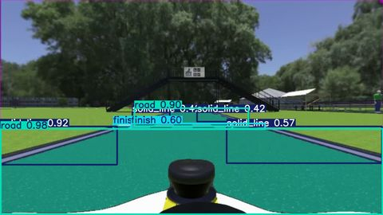

## AIM:
- To fit a YOLO11n Segmentation model on the ISC's new webots simulator output.
## Procedure:
- Use ```pip install ultralytics``` to install the prerequisites (venv recommended).
- clone this repo
- use bash or psh and execute ```yolo segment predict model=yolo11n-seg-clean4/weights/best.pt source=thevideo.mp4```
## Expected out:
Demo: [](https://www.dropbox.com/scl/fi/5wmrdvp0m59soe2z9oje7/centerLane.avi?rlkey=qk4m2493blise4xsxrte7jrnf&st=a450jh2h&raw=1)
